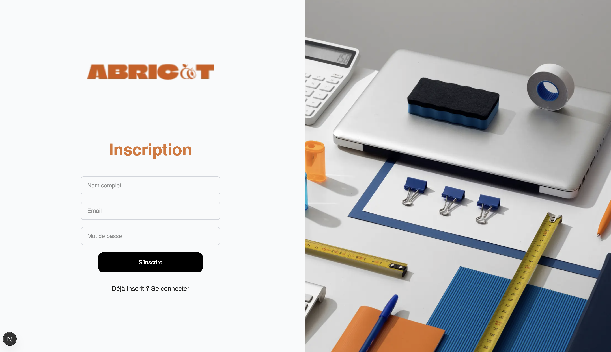
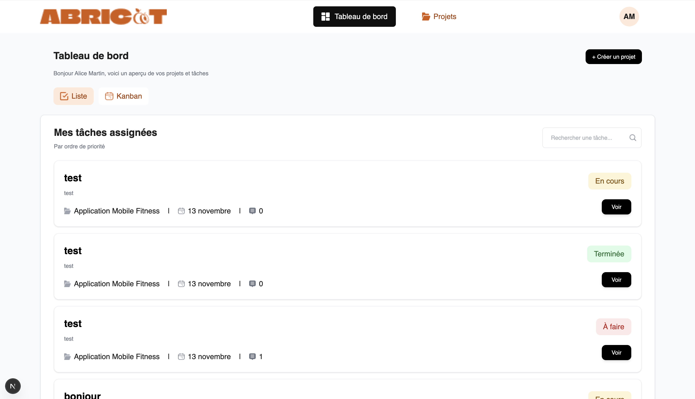
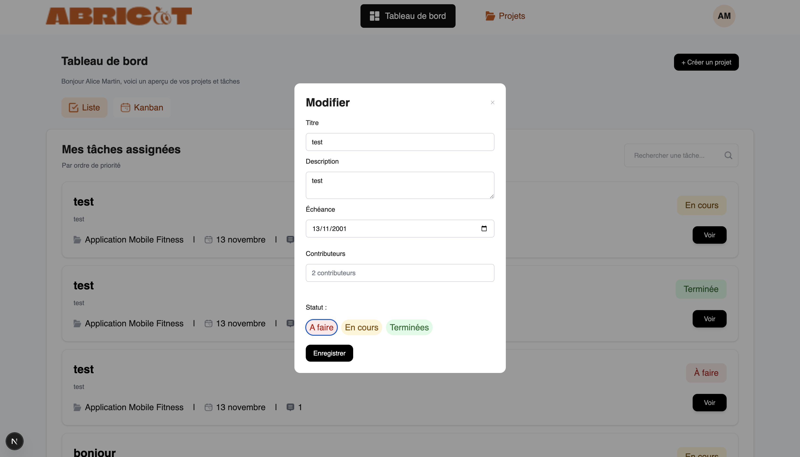
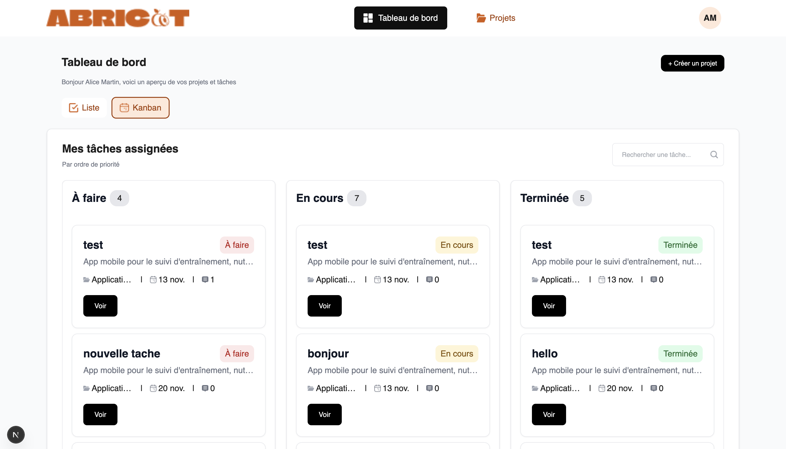
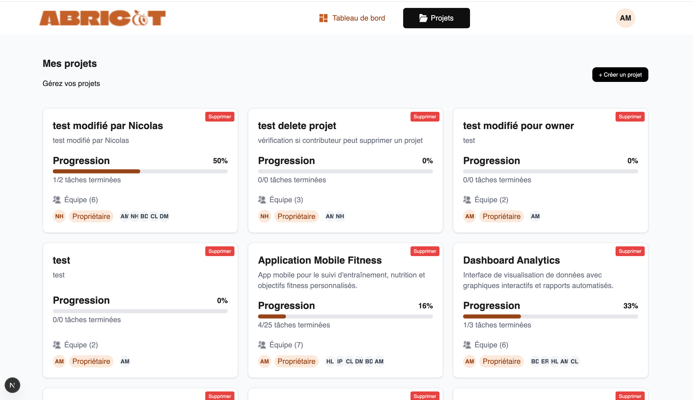
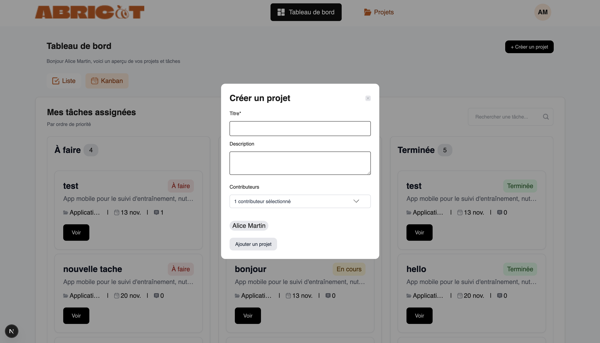
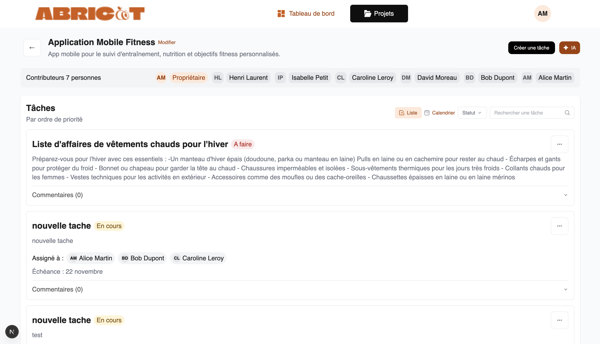
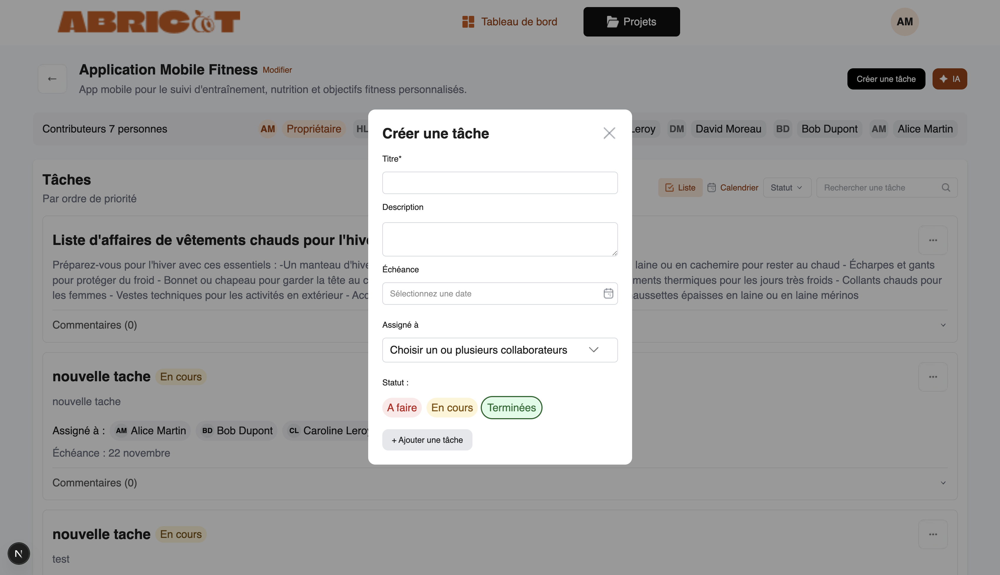
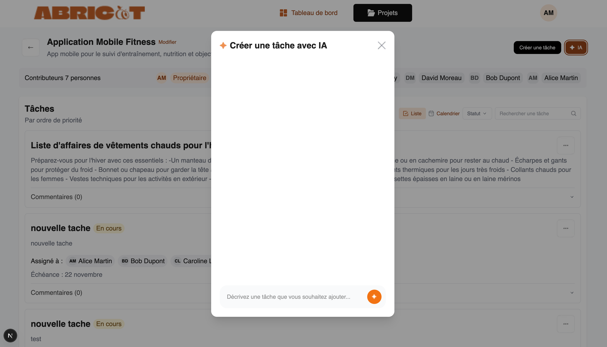
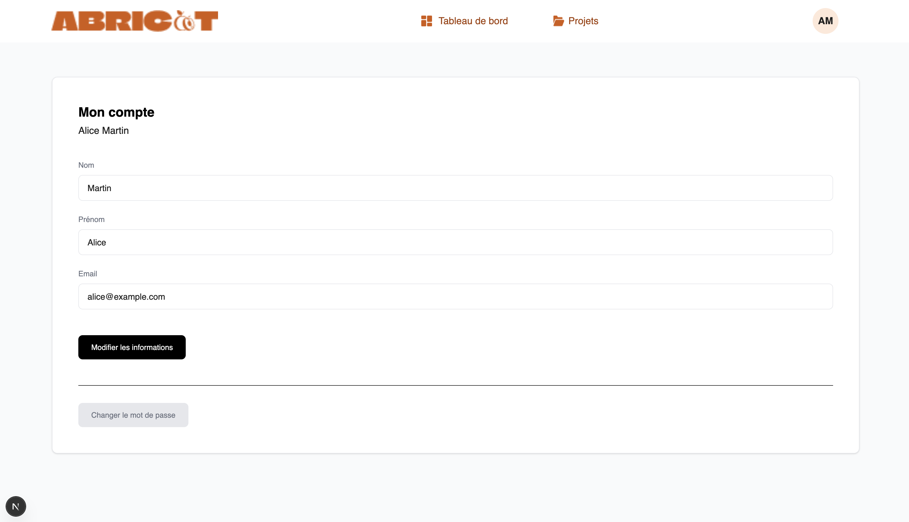

# 🍑 Abricot – Gestion de tâches & IA intégrée

_Application Next.js pour gérer projets, tâches, commentaires et génération IA._

---

## 🧭 Présentation du projet

**Abricot** est une application web moderne de gestion de projets et de tâches, pensée pour être simple, rapide et collaborative.  
Elle intègre :

- ✔️ Gestion de projets
- ✔️ Gestion de tâches
- ✔️ Commentaires en temps réel
- ✔️ Authentification JWT
- ✔️ Génération de tâches intelligente via IA (Mistral)
- ✔️ Interface soignée développée avec **Next.js + TailwindCSS**

Ce projet est construit dans un contexte pédagogique et professionnel : architecture claire, API REST propre et frontend modulaire.

---

## 🖼️ Aperçu de l’application

Voici quelques captures d’écran de l’interface utilisateur :













---

## 🎯 Fonctionnalités principales

| Domaine              | Fonctionnalités                                            |
| -------------------- | ---------------------------------------------------------- |
| **Authentification** | JWT, sessions, gestion utilisateur                         |
| **Projets**          | Création / édition / suppression, permissions              |
| **Tâches**           | CRUD complet, association à un projet                      |
| **Commentaires**     | Ajout, modification & suppression                          |
| **IA Mistral**       | Génération automatique de tâches selon un contexte         |
| **UI/UX**            | Interface moderne Next.js + TailwindCSS                    |
| **Sécurité**         | Vérification des droits d'accès backend + tokens sécurisés |

---

## 🏗️ Stack Technique

| Catégorie     | Technologie                                      |
| ------------- | ------------------------------------------------ |
| **Frontend**  | Next.js 14, React Server Components, TailwindCSS |
| **Backend**   | Node.js, Express / Fastify                       |
| **Database**  | PostgreSQL via Prisma                            |
| **IA**        | API Mistral (`@mistralai/mistralai`)             |
| **Auth**      | JWT, middlewares & guards                        |
| **Dev Tools** | ESLint, Prettier, GitHub, VSCode                 |

---

## Prerequisites

- Node.js >= 18
- npm / yarn / pnpm / bun
- PostgreSQL (if Prisma uses a database)
- `.env.local` file configured

---

## Setup

1. **Cloner le repository:**

```bash
git clone "https://github.com/hNnicolas/P11_Gestion_tache_IA"
cd frontend
```

2. **Installer les dépendances**

```bash
npm install
# or
yarn install
# or
pnpm install
```

3. **Configurer les variables d'environnement**
   Créez un fichier .env.local à la racine du projet (vous pouvez copier depuis .env.example) et remplissez vos propres valeurs :

```bash
# URL du backend (ex: http://localhost:5000)
BACKEND_URL=

# URL publique de l'API (ex: http://localhost:5000/api)
NEXT_PUBLIC_API_URL=

# Clé secrète pour JWT
JWT_SECRET=

# Clé API Mistral
MISTRAL_API_KEY=

```

4. **Initialiser la base de données (si Prisma est utilisé)**

```bash
npx prisma migrate dev
npx prisma generate
```

5. **Lancer le serveur de développement**

```bash
npm run dev
# or
yarn dev
# or
pnpm dev
# or
bun dev
```
